# MAQ DevelopFAST MCP Server

Azure Functions-based MCP (Model Context Protocol) server that provides AI-powered development assistance tools. This server automates various stages of the Software Development Life Cycle (SDLC) by providing specialized tools for requirements analysis, user story generation, architecture planning, and more.

## Tools

- **Reflection Tool**: Analyzes project requirements and generates structured summaries
- **User Stories Tool**: Generates actionable user stories with acceptance criteria
- **Approaches Tool**: Generates multiple implementation approaches for user stories
- **Architecture Tool**: Provides architecture overview and recommendations
- **Best Practice Checklist Tool**: Generates best practice checklists for requirements
- **Acceptance Criteria Test Cases Tool**: Generates test cases for acceptance criteria
- **Approach Document Tool**: Creates comprehensive approach documents
- **Open Questions Tool**: Generates clarifying questions for requirements

## Prerequisites and Deployment Guide

Follow these step-by-step instructions to deploy and configure the MAQ DevelopFAST MCP Server in your Azure environment.

### Step 1: Azure Subscription Setup

#### 1.1 Register Required Resource Providers

**Via Azure Portal:**
1. In your subscription page, click on **Resource providers** in the left menu
2. Register the following providers by searching for each and clicking **Register**:
   - `Microsoft.Web` (for Azure Functions)
   - `Microsoft.CognitiveServices` (for OpenAI services)
   - `Microsoft.KeyVault` (for Key Vault)
   - `Microsoft.Storage` (for Storage accounts)
   - `Microsoft.Insights` (for Application Insights)
   - `Microsoft.OperationalInsights` (for Log Analytics)
   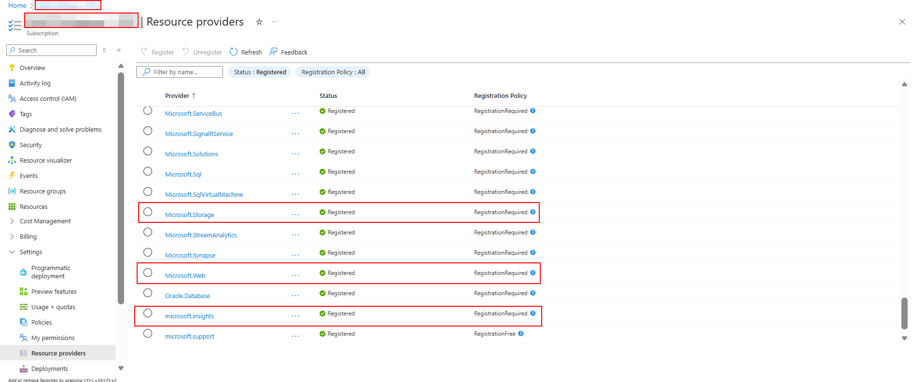
**Verification**: Ensure all providers show "Registered" status before proceeding.

### Step 2: Azure App Registration Configuration

Before deployment, you need an Azure App Registration to handle authentication for the MCP server.

#### 2.1 Create or Identify an App Registration
- In the Azure Portal, navigate to **Microsoft Entra ID** > **App registrations**.
- You can use an existing registration or create a new one (e.g., `MAQ-DevelopFAST-MCP-Auth`).
- Ensure it is a **Single-tenant** application; otherwise the DevelopFAST MCP server authentication in VS Code GitHub Copilot may fail.

#### 2.2 Note the Details
- Copy the **Application (client) ID** from the **Overview** tab for later use.

### Step 3: Deploy via Azure Marketplace

**Note:** The MAQ DevelopFAST MCP Server uses the Azure OpenAI GPT-4.1 model by default. Make sure your subscription has access to this model in the region you plan to deploy. **Prerequisite**: Ensure the selected region has available quota for **Azure OpenAI** (specifically **gpt-4.1**) with a minimum of **50k TPM** (Tokens Per Minute).

#### 3.1 Navigate to the Marketplace Offer
- Click the direct link: **[MAQ DevelopFAST MCP Server - Azure Marketplace](<link>)**
- Or search for "MAQ DevelopFAST MCP Server" in the Azure Portal Marketplace.

#### 3.2 Configure Deployment
- Click **Create**.
- Select your **Subscription** and **Resource Group**.
- **Region**: Select an Azure region that has available quota for **Azure OpenAI** (**gpt-4.1** with minimum **50k TPM**).
- **Function App Name**: Enter a unique name (e.g., `developfastmcpfunc`).
- **Application Insights Name**: Enter a name (e.g., `developfastmcpinsights`).
- **Log Analytics Workspace Name**: Enter a name (e.g., `developfastmcplogs`).
- **Hosting Plan Name**: Enter a name (e.g., `developfastmcpplan`).
- **Storage Account Name**: Enter a name (e.g., `storagedevelopfastsol`)
- **Key Vault Name**: Enter a name (e.g., `developfastmcpkv`).
- **Azure OpenAI Name**: Enter a name (e.g., `developfastmcpopenai`).

#### 3.3 Review + Create
- Click **Review + Create**, then **Create** once validation passes.
- Deployment typically takes 5-10 minutes.

### Step 4: Configure Function App Authentication

Once the deployment is completed, its time to protect your MCP server by requiring authentication.

#### 4.1 Add Identity Provider in the function app
- Go to the resource group and select your newly deployed **Function App**.
- Under **Settings**, click **Authentication** > **Add identity provider**.
- Select **Microsoft** as the provider.
- **Choose a tenant for your application and its users**: Select Workforce configuration (current tenant).
- **App registration type**: Select **Provide the details of an existing app registration**.
- **Application (client) ID**: Enter the Application (client) ID from Step 1.
- Keep 'Client secret' and 'Issuer URL' as it is.
- **Allowed token audiences**: `api://<client-id>` (Replace `<client-id>` with your Application (client) ID from Step 1).
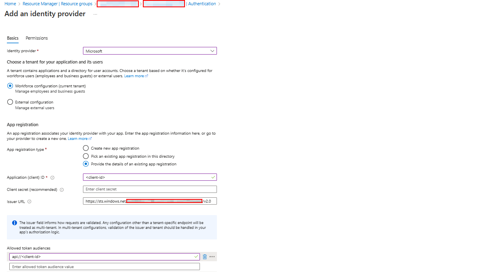

#### 4.2 Configure Additional Checks & Authentication
- **Client application requirement**: Select **Allow requests from specific client applications**.
- **Allowed client applications**: Add your Client ID (Application (client) ID from Step 1) and the VS Code client ID: `aebc6443-996d-45c2-90f0-388ff96faa56`.
- **Identity requirement**: Select **Allow requests from any identity**.
- **Tenant requirement**: Select **Allow requests only from the issuer tenant**.
- **Restrict access**: Select **Require authentication**.
- **Unauthenticated requests**: Select **HTTP 401 Unauthorized**.
- **Token store**: Ensure it is **Enabled**.
- Click **Add**.
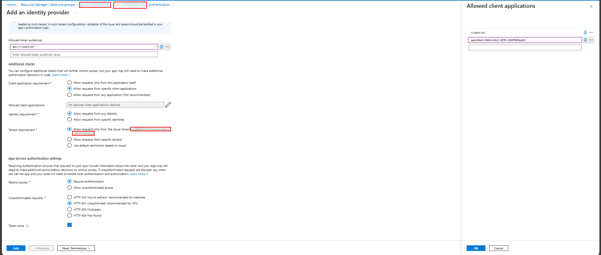

#### 4.3 Expose an API
- Navigate to your App Registration in the Azure Portal.
- On the left menu, select **Expose an API**.
- **Application ID URI**: Click **Add** next to Application ID URI. It will default to `api://<client-id>`. Click **Save**.
- **Add a scope**:
  - Click **+ Add a scope**.
  - **Scope name**: `user_impersonation`
  - **Who can consent?**: Select **Admins and users**.
  - **Admin consent display name**: `Access DevelopFAST MCP`
  - **Admin consent description**: `Allows the app to access the DevelopFAST MCP server on behalf of the signed-in user.`
  - Ensure **State** is set to **Enabled**.
  - Click **Add scope**.
  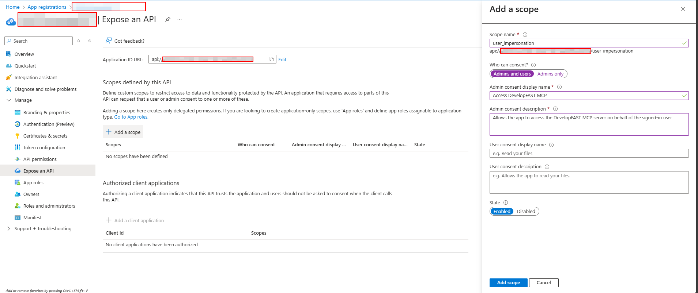
- **Authorize VS Code Client**:
  - Under **Authorized client applications**, click **+ Add a client application**.
  - **Client ID**: Enter VS Code's client ID: `aebc6443-996d-45c2-90f0-388ff96faa56`.
  - **Authorized scopes**: Select the checkbox for the scope you just created (e.g., `api://<client-id>/user_impersonation`).
  - Click **Add application**.
  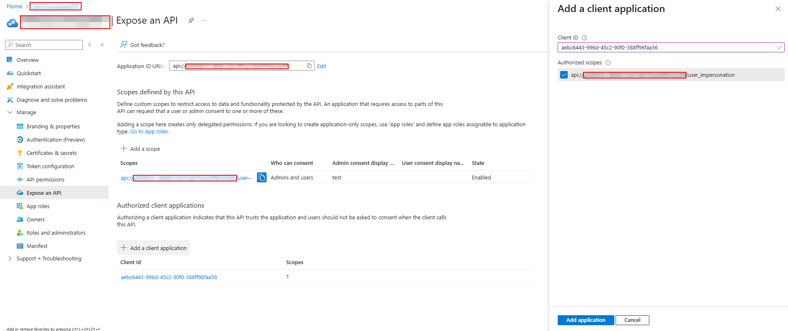

#### 4.4 Add Application Setting
- Back in the Function App, go to **Settings** > **Environment variables** (or **Configuration**).
- Add a new setting:
  - **Name**: `WEBSITE_AUTH_PRM_DEFAULT_WITH_SCOPES`
  - **Value**: `api://<your-client-id>/user_impersonation` (Replace `<your-client-id>` with the Application ID from Step 1)
- Click **Apply**, navigate to Overview from left-side panel and **Restart** the Function App.

**[Reference](<https://learn.microsoft.com/en-us/azure/azure-functions/functions-mcp-tutorial?tabs=mcp-extension&pivots=programming-language-csharp#enable-built-in-server-authorization-and-authentication>)**

---

## VS Code Integration

Once the server is deployed, follow these steps to integrate it with VS Code GitHub Copilot.

### Step 1: Adding the Server to VS Code

#### 1.1 Add the MCP Server
1. Open **VS Code**.
2. Press `Ctrl + Shift + P` and search and select **"MCP: Add Server..."**.
3. Select **HTTP (HTTP or Server-Sent Events)**.
4. Enter the DevelopFAST MCP Server endpoint: `https://<your-function-app-name>.azurewebsites.net/runtime/webhooks/mcp`
5. Provide a name: `DevelopFAST`.
6. Select **Global** to enable this MCP server for all workspaces, or **Workspace** to enable it only for the current workspace.
7. VS Code will automatically update your `mcp.json` with the new entry.

### Step 2: Authentication (Tenant-Restricted)

The MAQ DevelopFAST MCP Server uses MSAL for secure, tenant-restricted access.

#### 2.1 Sign In
Once the server is added, an authentication popup will appear automatically.

#### 2.2 Tenant Restriction
Sign in using your Microsoft account. Only users within your authorized tenant can authenticate.

#### 2.3 Activation
Once logged in, VS Code will display the DevelopFAST MCP server as **Active** in the GitHub Copilot tools panel.

#### 2.4 Verify Tools
To see the available tools:
- Open the **GitHub Copilot Chat** view (`Ctrl + Alt + I`).
- Click the **Tools** icon (hammer icon) in the chat input box.
- You will see the **DevelopFAST** tools listed under the MCP section.

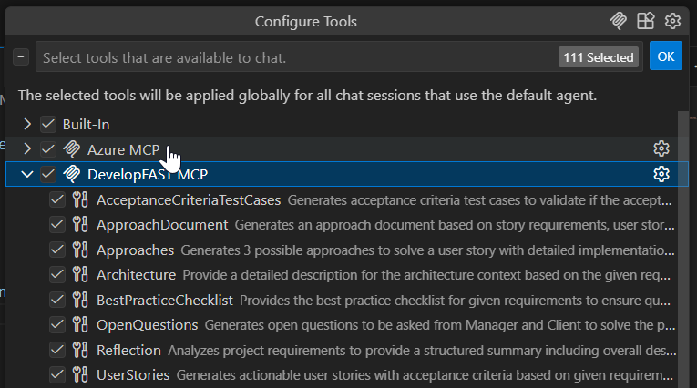

### Step 3: Using DevelopFAST Tools in GitHub Copilot

After authentication, GitHub Copilot automatically loads the DevelopFAST tools. You can use them in two ways:

#### 3.1 Automatic Tool Selection
Copilot analyzes your prompt, matches it with the tool descriptions, and calls the appropriate tool automatically.

- **Example 1 – Reflection Tool (automatic)**  
  - **User prompt:**  
    ```text
    Analyze this problem description and generate a structured summary.
    Title: Notification Feature Development
    Description: Develop a notification system for the application that alerts users about important updates, messages, or events. This feature should be integrated seamlessly into the existing application and provide timely and relevant notifications to enhance user engagement and experience.
    Assumptions: No explicit assumptions provided.
    ```
  - **What Copilot does:** Copilot automatically selects and calls the **Reflection Tool** with this prompt and then returns a structured summary in the chat.  
  - **Example output:** 
    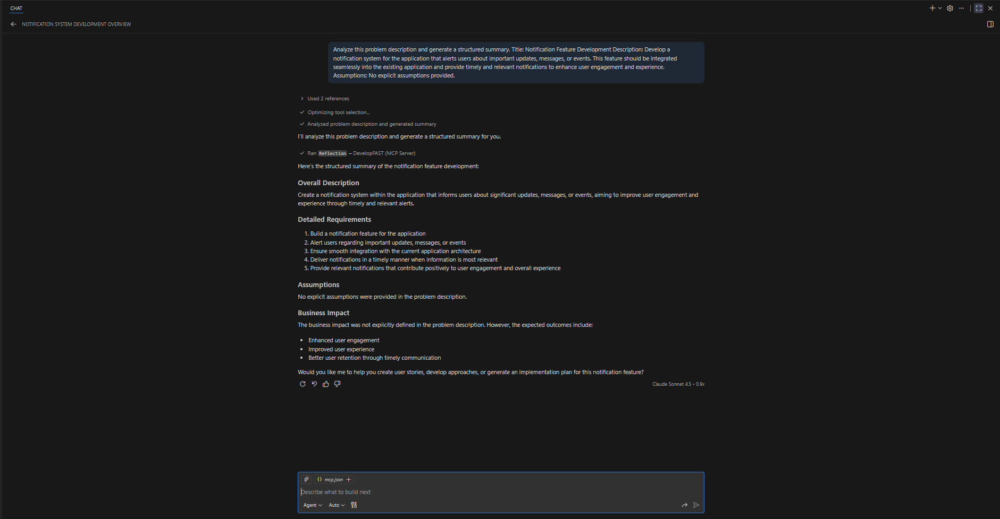

- **Example 2 – ApproachDocument Tool (automatic)**  
  - **User prompt:**  
    ```text
    Analyze this problem description and generate an approach document for it.
    Title: Notification Feature Development
    Description: Develop a notification system for the application that alerts users about important updates, messages, or events. This feature should be integrated seamlessly into the existing application and provide timely and relevant notifications to enhance user engagement and experience.
    Assumptions: No explicit assumptions provided.
    ```
  - **What Copilot does:** Copilot automatically selects and calls the **ApproachDocument Tool** with this prompt and then returns a detailed approach document in the chat.  
  - **Example output:** 
    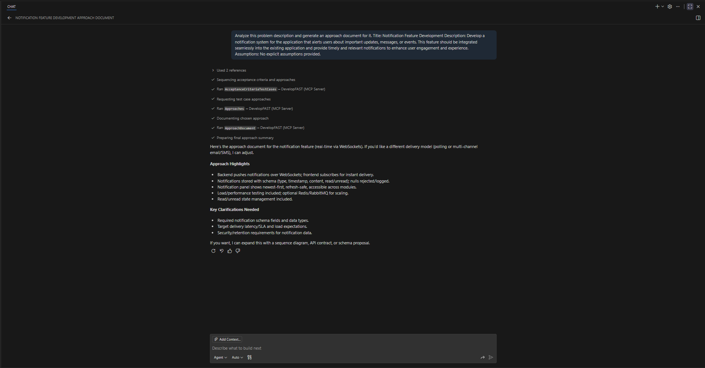

#### 3.2 Manual Tool Invocation
You can explicitly request a specific tool in your chat by mentioning it with `#tool_name` at the start of your message.

- **Example 1 – Reflection Tool (manual)**  
  - **User prompt:**  
    ```text
    #Reflection
    Title: Notification Feature Development
    Description: Develop a notification system for the application that alerts users about important updates, messages, or events. This feature should be integrated seamlessly into the existing application and provide timely and relevant notifications to enhance user engagement and experience.
    Assumptions: No explicit assumptions provided.
    ```
  - **What Copilot does:** Because `#Reflection` is specified, Copilot calls the **Reflection Tool**.  
  - **Example output:** 
    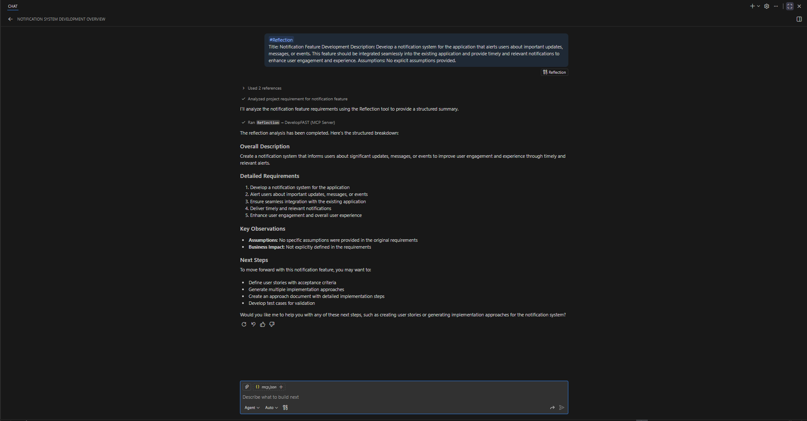

- **Example 2 – ApproachDocument Tool (manual)**  
  - **User prompt:**  
    ```text
    #ApproachDocument
    Title: Notification Feature Development
    Description: Develop a notification system for the application that alerts users about important updates, messages, or events. This feature should be integrated seamlessly into the existing application and provide timely and relevant notifications to enhance user engagement and experience.
    Assumptions: No explicit assumptions provided.
    ```
  - **What Copilot does:** Because `#ApproachDocument` is specified, Copilot calls the **ApproachDocument Tool**.  
  - **Example output:** 
    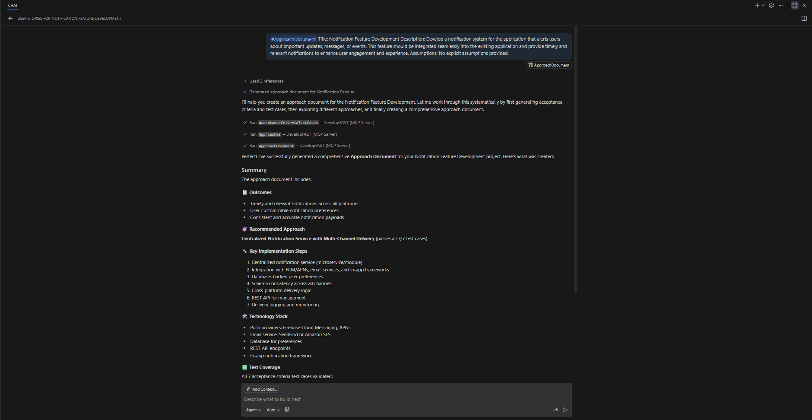

**Note**: Copilot may also automatically call other related tools to provide a comprehensive response.

---

## Use your own Azure OpenAI Model (Optional)
If you wish to use your own Azure OpenAI model instead of the default one, follow these steps:

**Prerequisite:** The user performing these steps must have the **Key Vault Secrets Officer** role (or equivalent permissions) on the Key Vault.

- Navigate to the **Key Vault** created during deployment.
- Under **Objects**, select **Secrets**.
- Update the secret value for your Azure OpenAI model deployment name.
- Ensure the model is deployed in the Azure OpenAI resource with a minimum of **50K TPM** (Tokens Per Minute) allotted.

---

## Use Case: Implement Role-Based Access Control (RBAC) for my application

### Feature Description: 
The system should implement Role-Based Access Control (RBAC) to manage user permissions. Users are assigned predefined roles (e.g., Admin, Editor, Viewer), and access to system features and resources is granted based on these roles. The solution must support role assignment, permission mapping, access enforcement, and audit logging for authorization changes.

**1. Reflection Tool**

User prompt:
```text
#Reflection 
The system should implement Role-Based Access Control (RBAC) to manage user permissions. Users are assigned predefined roles (e.g., Admin, Editor, Viewer), and access to system features and resources is granted based on these roles. The solution must support role assignment, permission mapping, access enforcement, and audit logging for authorization changes.
```
<details><summary>Output</summary>
I'll analyze your RBAC requirements using the Reflection tool to produce a structured summary (description, detailed requirements, assumptions, business impact), then I’ll present that back in a concise form.

Ran `Reflection` 
Completed with input: {
  "problem_description": "The system should implement Role-Based Access Control (RBAC) to manage user permissions. Users are assigned predefined roles (e.g., Admin, Editor, Viewer), and access to system features and resources is granted based on these roles. The solution must support role assignment, permission mapping, access enforcement, and audit logging for authorization changes."
}

Here’s the structured reflection for your RBAC requirement:

**Overall Description**  
- Implement RBAC so that user access is controlled via predefined roles (Admin, Editor, Viewer, etc.), with features/resources accessible based on those roles.  
- The solution must cover role assignment, permission mapping, access enforcement, and audit logging of authorization changes.

**Detailed Requirements**  
- Use RBAC as the core authorization model.  
- Support assigning one or more predefined roles to users.  
- Define and maintain a clear mapping from roles to permissions (features/actions/resources).  
- Enforce access at runtime based on the user’s effective permissions.  
- Log all authorization-related changes (role assignments, revocations, permission changes) for auditability.  

**Assumptions (implicit, to be confirmed)**  
- Roles and permissions are relatively stable but may evolve over time.  
- There is an existing user identity model to attach roles to.  
- Audit logs need to be queryable for compliance or security reviews.

**Business Impact (implicit)**  
- Reduces security risk by ensuring least-privilege access.  
- Simplifies permission management by grouping permissions into roles.  
- Provides traceability for authorization changes to support compliance and incident investigations.

If you’d like, I can next help you turn this into concrete user stories and acceptance criteria, or into a design (schema, APIs, middleware) for implementing RBAC in your tech stack.
</details>

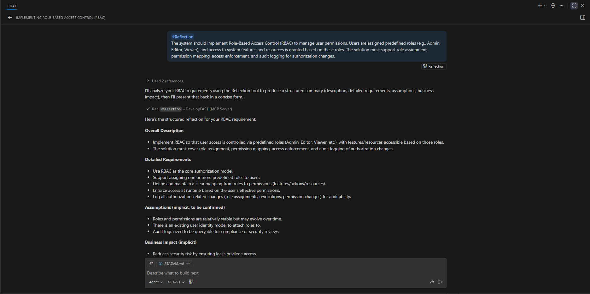

**2. User Stories Tool**

User prompt:
```text
Yes, generate 3 user stories
```
<details><summary>Output</summary>
I’ll generate 3 concrete, implementation-ready user stories (each with acceptance criteria) based on your RBAC requirement.

Ran `UserStories` 
Completed with input: {
  "requirements": "The system should implement Role-Based Access Control (RBAC) to manage user permissions. Users are assigned predefined roles (e.g., Admin, Editor, Viewer), and access to system features and resources is granted based on these roles. The solution must support role assignment, permission mapping, access enforcement, and audit logging for authorization changes.",
  "number_of_stories": 3
}

Here are 3 user stories for your RBAC feature:

# User Story 1  
**Title**  
Implement Role Assignment Functionality  

**Description**  
As an administrator, I want to assign predefined roles (Admin, Editor, Viewer) to users so that their permissions can be managed efficiently.  

**Acceptance Criteria**  
- Administrators can search/select a user and assign one or more predefined roles.  
- The system displays a list of predefined roles for selection during assignment.  
- Role assignments are reflected immediately in the user’s profile and effective permissions.  
- An error message is shown if an invalid or deprecated role is selected.  

---

# User Story 2  
**Title**  
Map Permissions to Roles and Enforce Access  

**Description**  
As a system architect, I want each predefined role to be mapped to specific permissions and enforced at runtime so that users only access features and resources allowed by their roles.  

**Acceptance Criteria**  
- Each predefined role is mapped to a defined set of permissions (features/actions/resources).  
- Users can only access features and resources permitted by their assigned roles.  
- Unauthorized access attempts are blocked and return a standard “access denied” response.  
- Unauthorized access attempts are logged with user, resource, action, and timestamp.  
- Permission changes to roles take effect for all affected users without requiring re-login (or with clearly defined behavior).  

---

# User Story 3  
**Title**  
Implement Audit Logging for Authorization Changes  

**Description**  
As a security officer, I want all authorization changes (role assignments and permission updates) to be logged so that I can review who changed what and when for security and compliance.  

**Acceptance Criteria**  
- All role assignment, role revocation, and role-permission mapping changes are recorded in an immutable audit log.  
- Each audit entry contains: acting user, target user or role, action performed, timestamp, and previous/new values.  
- Authorized administrators can view and filter audit logs by date range, user, role, and action type.  
- Unauthorized users cannot view, modify, or delete audit log entries.  

If you’d like, I can now help you break these into tasks or sketch the data model and API endpoints to implement them.
</details>

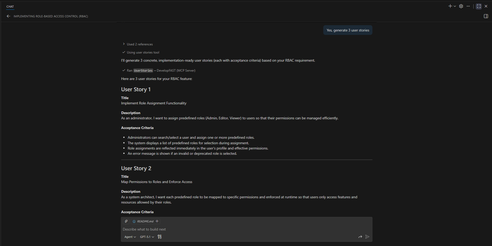

**3. Test Cases Tool**

User prompt:
```text
For the first user story generate test cases
```
<details><summary>Output</summary>
I’ll generate structured test cases for User Story 1 (role assignment) using the test-case tool, then summarize them for you.

Ran `AcceptanceCriteriaTestCases` 
Completed with input: {
  "story_requirements": "User Story 1: Implement Role Assignment Functionality.\n\nDescription:\nAs an administrator, I want to assign predefined roles (Admin, Editor, Viewer) to users so that their permissions can be managed efficiently.\n\nAcceptance Criteria:\n- Administrators can search/select a user and assign one or more predefined roles.\n- The system displays a list of predefined roles for selection during assignment.\n- Role assignments are reflected immediately in the user’s profile and effective permissions.\n- An error message is shown if an invalid or deprecated role is selected.",
  "context": "RBAC implementation with predefined roles (Admin, Editor, Viewer). Web-based admin UI. Assume validation and persistence via backend API."
}

Here are test cases for User Story 1 (Implement Role Assignment Functionality):

**Test Case 1 – Assign predefined roles to a user**  
- Script:  
  1. Log in as administrator.  
  2. Search for an existing user.  
  3. Select the user and choose one or more roles (Admin, Editor, Viewer).  
  4. Submit the role assignment.  
- Expected:  
  - User is found and selectable.  
  - Predefined roles are shown.  
  - Selected roles are assigned successfully without error.  

**Test Case 2 – Display of predefined roles**  
- Script:  
  1. Log in as administrator.  
  2. Open role assignment for any user.  
  3. Inspect the roles list and try selecting each one.  
- Expected:  
  - Only Admin, Editor, Viewer are displayed.  
  - Each role is selectable without error.  

**Test Case 3 – Immediate reflection in profile and permissions**  
- Script:  
  1. As admin, assign Editor role to a user.  
  2. Open that user’s profile immediately.  
  3. Log in (or impersonate) as that user and try an Editor-only action.  
- Expected:  
  - Profile shows the Editor role.  
  - Editor-only action is allowed right away.  

**Test Case 4 – Invalid/deprecated role error**  
- Script:  
  1. Log in as administrator.  
  2. Attempt to assign a non-predefined role (e.g., “SuperAdmin” or deprecated role) by API or UI.  
  3. Submit assignment.  
- Expected:  
  - Assignment is rejected.  
  - Clear error message indicates role is invalid or deprecated.  

**Test Case 5 – Role assignment data correctness (backend)**  
- Script:  
  1. Assign a predefined role to a user.  
  2. Retrieve the user’s roles from backend API/DB.  
- Expected:  
  - Record contains correct user ID, role name, and timestamp.  
  - Only allowed roles are stored (no invalid roles).  

**Test Case 6 – Consistency between UI and API**  
- Script:  
  1. Assign multiple roles to several users in the UI.  
  2. Fetch assigned roles for those users via API.  
- Expected:  
  - API responses match exactly what was assigned in UI for each user.  

**Test Case 7 – No delay in latest data**  
- Script:  
  1. Update a user’s role as admin.  
  2. Immediately refresh the profile and call the API.  
- Expected:  
  - Both UI and API show updated roles with no noticeable delay.  

If you want, next I can generate test cases for User Story 2 (permissions & access enforcement) or help you map these into your preferred test format (e.g., Jest, Postman, Selenium).
</details>

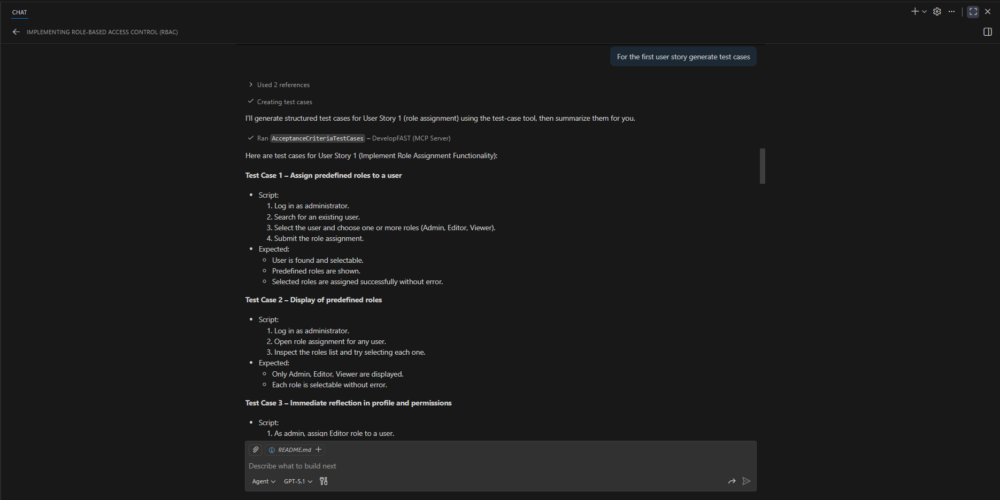

**4. Architecture Tool**

User prompt:
```text
#Architecture  Analyze the current Architecture file
```
<details><summary>Output</summary>
I’ll use the Architecture tool to analyze your RBAC requirements against the current Architecture.json file path and then summarize the findings.

Ran `Architecture` 
Completed with input: {
  "story_requirements": "The system should implement Role-Based Access Control (RBAC) to manage user permissions. Users are assigned predefined roles (e.g., Admin, Editor, Viewer), and access to system features and resources is granted based on these roles. The solution must support role assignment, permission mapping, access enforcement, and audit logging for authorization changes.",
  "architecture_context": "c:/Users/RitikManishbhaiPopat/Downloads/readme (3)/readme/Architecture.json"
}

Here’s a concise analysis of your Architecture.json in the context of the RBAC requirement:

**What the architecture assumes**  
- Azure-centric solution with: Azure AD for identity, App Services/Functions for business logic, Azure SQL/Storage for data, Azure networking (VNet/App Gateway).  
- RBAC is layered on top of this with: role/permission management, enforcement logic, and audit logging.

**Key RBAC components identified**  
- RBAC mechanism and role-permission model.  
- Role & permission management UI/API for administrators.  
- Access enforcement logic (middleware/policy engine) in application services.  
- Audit logging for authorization changes (e.g., via Azure Monitor).  
- User–role assignment workflows integrated with existing identity (Azure AD).

**Additional components recommended**  
- Azure RBAC for Azure resource-level control (if not already used).  
- Azure Monitor / Log Analytics for centralized audit logs.  
- Custom Role Management API or Azure AD PIM for controlled, auditable role assignment.  
- Secure storage (SQL/Table storage) for application-level role–permission mappings.  
- Application-level access enforcement middleware for consistent checks.

**How the updated architecture works end-to-end**  
- Users authenticate through Azure AD.  
- Admins manage roles and permissions via Role Management API/PIM, persisted in secure storage.  
- Application services query role-permission mappings and enforce access before serving features/resources.  
- All role changes and access attempts are logged to Azure Monitor for auditing and compliance.

If you share the actual contents of Architecture.json, I can tighten this further into a precise component diagram and concrete integration points (APIs, storage schema, and where to put enforcement middleware).
</details>

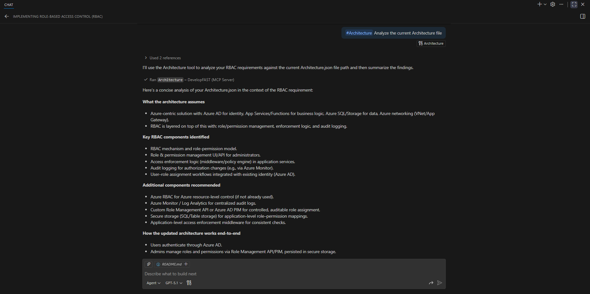

**5. Best Practice Checklist Tool**

User prompt:
```text
#BestPracticeChecklist provide me a best practice checklist
```
<details><summary>Output</summary>
I’ll generate a best-practice checklist tailored to your RBAC requirement and current architecture context using the checklist tool.

Ran `BestPracticeChecklist` 
Completed with input: {
  "requirements": "The system should implement Role-Based Access Control (RBAC) to manage user permissions. Users are assigned predefined roles (e.g., Admin, Editor, Viewer), and access to system features and resources is granted based on these roles. The solution must support role assignment, permission mapping, access enforcement, and audit logging for authorization changes.",
  "architecture_context": "c:/Users/RitikManishbhaiPopat/Downloads/readme (3)/readme/Architecture.json"
}

Here’s an RBAC best-practice checklist tailored to your scenario:

**Role Assignment**  
- Define clear roles (Admin, Editor, Viewer) with responsibilities.  
- Ensure every user has at least one valid role.  
- Keep user–role mappings in a centralized, authoritative store.  
- Automate role assignment where possible (e.g., by department/attributes).  
- Support temporary/time-bound roles and review them regularly.  
- Perform periodic role recertification (access reviews).

**Permission Mapping**  
- Map permissions to roles, not directly to individual users.  
- Apply least-privilege when assigning permissions to each role.  
- Document all permissions and their role mappings.  
- Consider hierarchical/composite roles for complex setups.  
- Periodically audit mappings to remove unused or redundant permissions.  

**Access Enforcement**  
- Enforce checks at all entry points (APIs, UI, background jobs).  
- Default to “deny” unless explicitly allowed by role.  
- Log all denied access attempts with user, action, and resource.  
- Centralize enforcement logic (e.g., middleware/policy engine).  
- Consider context-aware rules (location, device, time) and JIT elevation for exceptions.

**Audit Logging (Authorization Changes)**  
- Log all role assignments, revocations, and permission mapping changes.  
- Include who made the change, what changed, when, and why (if possible).  
- Store logs securely in tamper-evident, append-only style storage.  
- Integrate logs with a central monitoring/SIEM system for alerts.  
- Regularly review logs for anomalies and compliance reporting.

If you’d like, I can now help you map this checklist to concrete implementation tasks or update your Architecture.json/README to reflect these practices.
</details>

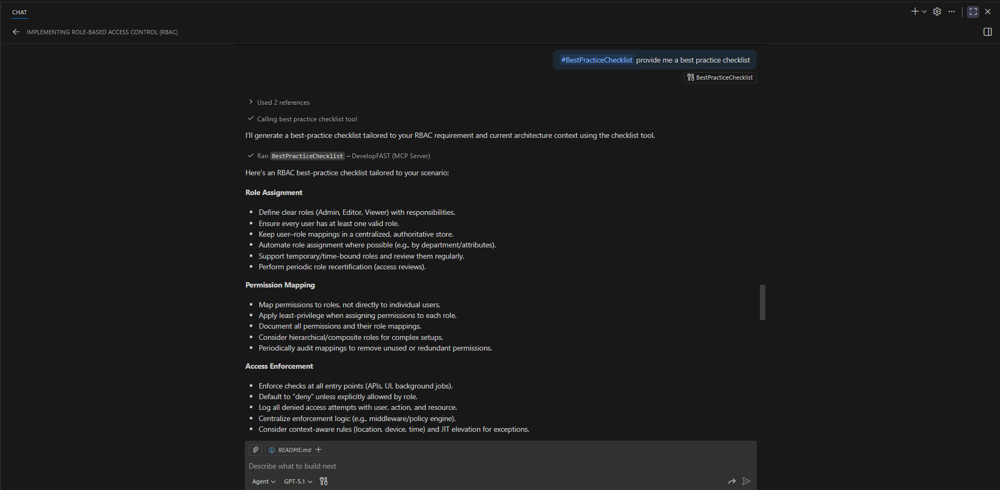

**6. Approaches Tool**

User prompt:
```text
Generate all the possible approaches
```
<details><summary>Output</summary>
I’ll generate multiple implementation approaches for your RBAC requirement using the Approaches tool, then summarize them for you.

Ran `Approaches` 
Completed with input: {
  "story_requirements": "The system should implement Role-Based Access Control (RBAC) to manage user permissions. Users are assigned predefined roles (e.g., Admin, Editor, Viewer), and access to system features and resources is granted based on these roles. The solution must support role assignment, permission mapping, access enforcement, and audit logging for authorization changes.",
  "architecture_context": "c:/Users/RitikManishbhaiPopat/Downloads/readme (3)/readme/Architecture.json",
  "acceptance_criteria_test_cases": "High level tests: 1) Admin can assign predefined roles to users; 2) Only predefined roles are shown for assignment; 3) Role changes immediately affect user permissions; 4) Unauthorized access is blocked and logged; 5) All role/permission changes are captured in an immutable audit log."
}

Here are three solid approaches for your RBAC implementation:

**Approach 1 – Database‑centric custom RBAC**  
- Model Users, Roles, Permissions, and Role-Permission mappings in your relational DB.  
- Build APIs/UI for role assignment and permission management.  
- Implement access checks in backend middleware using DB lookups.  
- Store role/permission changes and access denials in an audit table (append-only).  
- Pros: Full control, transparent schema, easy auditing; good for most CRUD apps.  
- Cons: More custom code; must design indexes and log retention carefully.

**Approach 2 – RBAC via framework/library (recommended)**  
- Integrate an RBAC/authorization framework (e.g., Spring Security, Casbin, Django auth/guardian).  
- Configure predefined roles and permissions in the library or config.  
- Use library APIs/annotations to enforce access at controllers/handlers.  
- Add hooks to log all role changes and access denials to your audit store.  
- Pros: Fast to implement, battle-tested, maintainable, immediate effect of role changes.  
- Cons: Some constraints from the library’s model; custom audit needs integration.

**Approach 3 – Policy-as-code (OPA or similar)**  
- Represent roles and permissions as policies (e.g., Rego in Open Policy Agent).  
- On each request, call the policy engine with user, action, resource for a decision.  
- Manage user-role assignments in your app, and update policies as needed.  
- Send all role/permission changes and denials to an external immutable audit log.  
- Pros: Very flexible, decouples auth logic, great for complex/enterprise scenarios.  
- Cons: Higher setup/operational complexity; requires extra components and tuning.

If you tell me your tech stack (e.g., .NET, Node.js, Java, Python), I can detail the recommended approach 2 with specific libraries, data structures, and sample middleware.
</details>

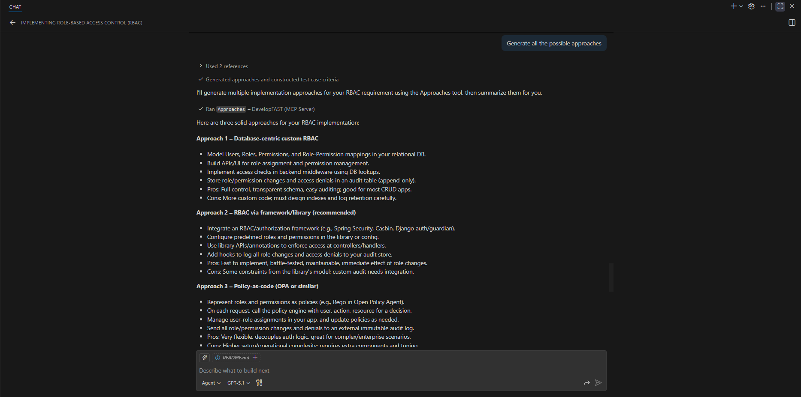

**7. Open Questions Tool**

User prompt:
```text
Provide list of open questions i can ask to customer
```
<details><summary>Output</summary>
I’ll generate a focused list of clarification questions for your customer about the RBAC feature using the OpenQuestions tool, then summarize them clearly.

Ran `OpenQuestions` 
Completed with input: {
  "story_requirements": "The system should implement Role-Based Access Control (RBAC) to manage user permissions. Users are assigned predefined roles (e.g., Admin, Editor, Viewer), and access to system features and resources is granted based on these roles. The solution must support role assignment, permission mapping, access enforcement, and audit logging for authorization changes.",
  "context": "Azure-oriented architecture with potential use of Azure AD and standard web backend. You already have user stories, test cases, architecture notes, and best-practice checklist for this RBAC feature."
}

Here’s a concise list of open questions you can ask your customer:

**Role definitions**  
- What exact permissions/actions should Admin, Editor, and Viewer each have?  
- Do you expect any additional or custom roles now or in the near future?

**Permission mapping**  
- How granular should permissions be (feature-level, screen-level, record-level, specific actions)?  
- Are there any exceptions or special cases where users in the same role should have different permissions?

**Role assignment**  
- Who in your organization will be responsible for assigning and managing roles?  
- Should role assignment be manual only, or also automated (e.g., based on department, location, group)?  

**Access enforcement**  
- Which features and data are most sensitive and must be strictly protected by RBAC?  
- Do you have scenarios where users need temporary or elevated access? How should that work?

**Audit logging**  
- Which details must audit logs capture for authorization changes (e.g., actor, target, before/after values, reason)?  
- How long should we retain audit logs, and who is allowed to view them?

**Identity / Azure AD integration**  
- Should we integrate RBAC with your existing identity system (e.g., Azure AD groups/roles), or manage roles only inside this app?  
- Are there any security or compliance constraints we must follow for identity and roles?

**User experience**  
- What kind of UI do you expect for admins to manage users, roles, and permissions?  
- Should end users be notified when their roles or access levels change? If yes, how (email, in-app)?

**Reporting and monitoring**  
- Do you need reports on who has which roles and how that changes over time?  
- How should unauthorized access attempts be surfaced (dashboards, alerts, periodic reports)?

**Scalability and scope**  
- Will this RBAC model be used only for this application, or shared across multiple apps/services in the future?  
- Do you need support for multiple tenants or organizations with separate role structures?

**Compliance and standards**  
- Are there specific regulations or standards (e.g., GDPR, HIPAA, ISO) that the RBAC design must comply with?  
- Do you have internal security or audit guidelines we should align to?

If you tell me your domain (e.g., healthcare, finance, SaaS), I can refine this list with a few domain-specific questions.
</details>

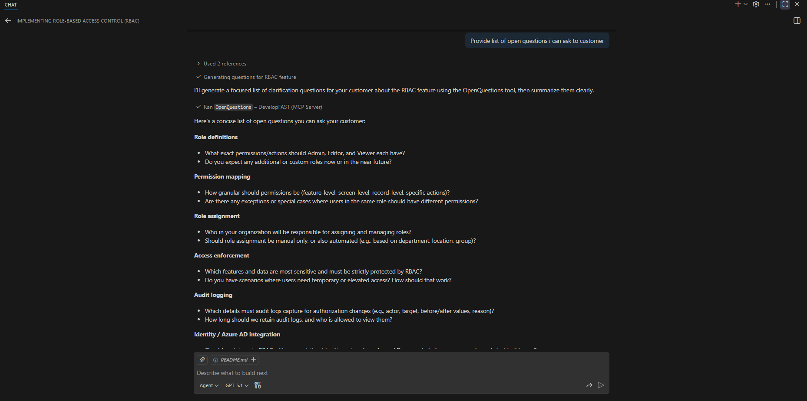 

**8. Approach Document Tool**

User prompt:
```text
Please provide a detailed approach document for the recommended approach
```
<details>
<summary>Output</summary>
I’ll generate a structured, detailed approach document for the recommended (library-based) RBAC approach using the dedicated approach-document tool.

Ran `ApproachDocument` 
Completed with input: {
  "story_requirements": "The system should implement Role-Based Access Control (RBAC) to manage user permissions. Users are assigned predefined roles (e.g., Admin, Editor, Viewer), and access to system features and resources is granted based on these roles. The solution must support role assignment, permission mapping, access enforcement, and audit logging for authorization changes.",
  "acceptance_criteria_test_cases": "High level tests: 1) Admin can assign predefined roles to users; 2) Only predefined roles are shown for assignment; 3) Role changes immediately affect user permissions; 4) Unauthorized access is blocked and logged; 5) All role/permission changes are captured in an immutable audit log.",
  "approach_chosen": "Approach 2 – RBAC via framework/library. Integrate an RBAC/authorization framework (e.g., Spring Security, Casbin, Django auth/guardian). Configure predefined roles and permissions. Use library APIs/annotations to enforce access. Add hooks to log all role changes and access denials to an immutable audit store.",
  "context": "Azure-oriented web application, likely with Azure AD for authentication and a typical backend (e.g., .NET/Java/Node/Python)."
}

Here’s a detailed approach document for the recommended (library-based) RBAC approach:

**Outcome**  
- Users have predefined roles (Admin, Editor, Viewer) that govern access.  
- Unauthorized access is blocked and logged.  
- All role and permission changes are written to an immutable audit log.

**High-Level Approach**  
- Use an RBAC/authorization framework suited to your stack (e.g., Spring Security, ASP.NET Authorization, Casbin, Django auth/guardian).  
- Configure roles and permissions in the framework, not ad hoc in code.  
- Implement admin flows for assigning roles to users.  
- Enforce access via framework annotations/middlewares/filters.  
- Wire framework events (or your service layer) into an audit logging component.

**Key Design Elements**  
- Roles: Admin, Editor, Viewer defined centrally (config or DB).  
- Permissions: Feature/resource-level actions (e.g., “manage_users”, “edit_content”, “view_reports”) mapped to roles in the framework.  
- User–role storage: Stored in your existing user store (DB) and surfaced through the framework’s user/claims model.  
- Enforcement:  
  - At controller/route level via annotations (e.g., `@PreAuthorize("hasRole('ADMIN')")`, `[Authorize(Roles="Admin")]`) or middleware.  
  - At domain/service level for sensitive operations (defense in depth).  
- Audit logging:  
  - Role assignments/changes: logged whenever admins add/remove roles or change mappings.  
  - Access denials: logged with user, resource, action, timestamp, and reason.  
  - Stored in append-only/immutable style storage (e.g., write-once table, log index with no update/delete from app).

**Implementation Steps**  
1. Framework selection and setup  
   - Choose RBAC/authorization library matching your backend stack.  
   - Enable authentication integration (likely Azure AD → JWT/claims → framework principal).  

2. Role & permission model  
   - Enumerate all features/resources and actions that need protection.  
   - Define roles and map them to permissions in config or DB (as supported by the library).  
   - Enforce “no direct user → permission” mapping; always user → roles → permissions.  

3. Role assignment flows  
   - Build admin UI/API to:  
     - List users and their current roles.  
     - Assign/remove only allowed roles (Admin/Editor/Viewer, plus any agreed extensions).  
   - Validate requested role is in the predefined set before updating.  
   - After a successful change, emit an audit event (who, target user, roles before/after, time).  

4. Access enforcement  
   - Protect all secured endpoints with role/permission checks via the library.  
   - For any access denial:  
     - Return a standard forbidden response.  
     - Emit an audit/log event capturing user, action, resource, and context.  
   - Ensure role updates propagate quickly to active sessions (e.g., short-lived tokens or cache invalidation, as supported by your stack).

5. Audit logging implementation  
   - Define an audit log record schema: id, actor, target, action type (assign_role, revoke_role, role_mapping_change, access_denied), before/after, timestamp, correlation/request id.  
   - Implement an audit logger service that all role-management and authorization code calls.  
   - Ensure immutability at the application level (no updates/deletes), with DB policies or log storage backing that up.  
   - Optionally integrate with a central monitoring/SIEM system for alerting and reporting.

6. Testing and acceptance  
   - Verify:  
     - Admin can assign only predefined roles; invalid roles are rejected.  
     - Only predefined roles appear in UI/API.  
     - Role changes take effect immediately in access decisions.  
     - Unauthorized access is consistently blocked and logged.  
     - Every role/permission change produces a correct, immutable audit entry.

**Open Points / Clarifications**  
- Exact backend stack (e.g., .NET, Java, Node, Python) to pick the concrete library and syntax.  
- Where and how the audit log is stored (database table, log index, or dedicated audit service) and retention/compliance rules.  
- How tightly RBAC should integrate with Azure AD roles/groups vs. application-local roles.

If you tell me your specific tech stack, I can refine this into a stack-specific design with suggested libraries, example annotations/middleware, and schema outlines.
</details>

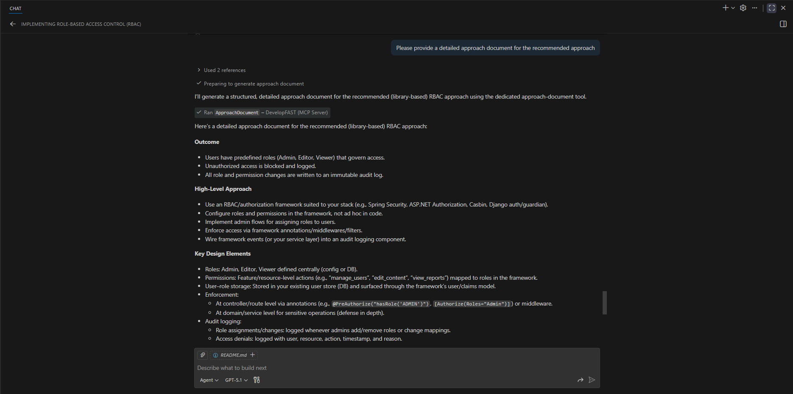 

## Key Results and Benefits
- This MCP Server accelerates SDLC activities by turning high-level requirements into user stories, test cases, and approach documents within minutes.
- Improves consistency and quality of requirements, design, and test assets through standardized, repeatable MCP tools.
- Reduces rework and ambiguity by capturing assumptions, open questions, and acceptance criteria early in the lifecycle.
- Enhances collaboration between business and engineering teams by providing clear, shareable outputs (JSON, Markdown, and documents).

## Best Practices
- Start every feature by running the Reflection and User Stories tools to clarify scope before designing or coding.
- Keep your Architecture.json file up to date so the tools can generate context-aware guidance.
- Use the Approaches and Approach Document tools to compare solution options before committing to a design, especially for complex features.
- Treat generated stories, checklists, test cases, and approach documents as living artifacts: review and refine them before using them.

## License
MIT License

## Author
**[MAQ Software](< https://maqsoftware.com/>)**

## Support
For issues and questions, please reach us out at: customersuccess@maqsoftware.com